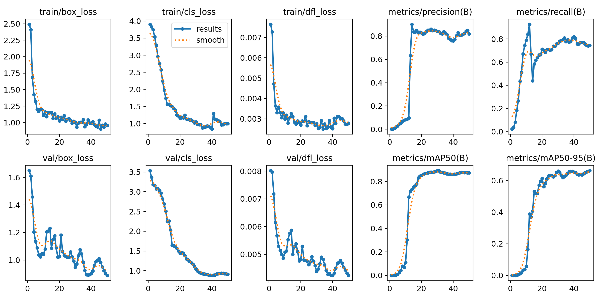
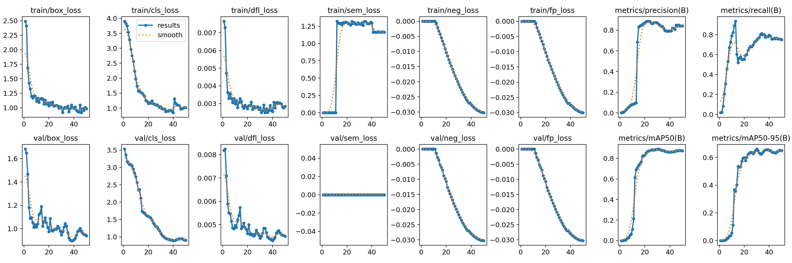
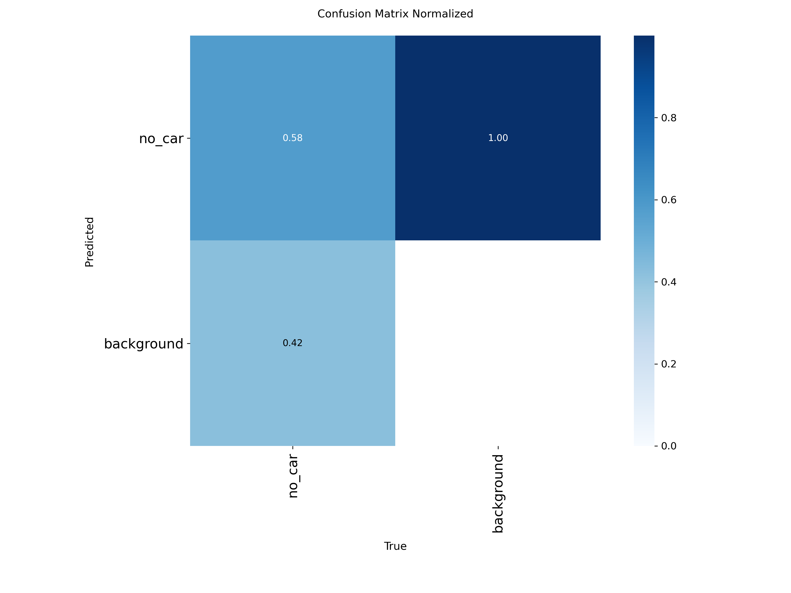
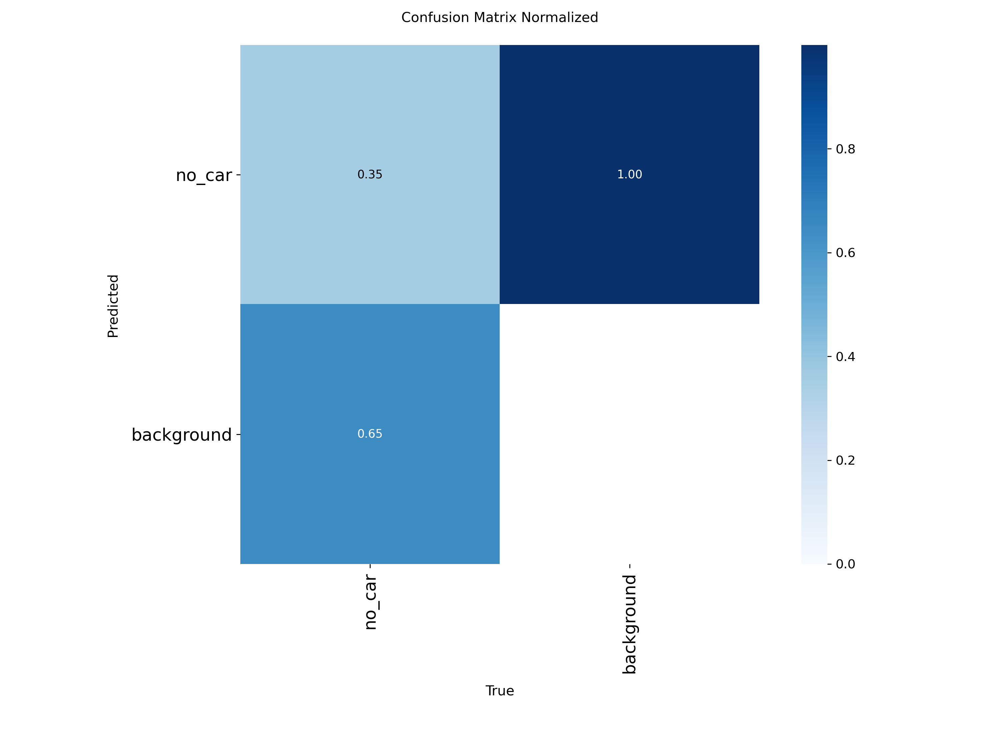
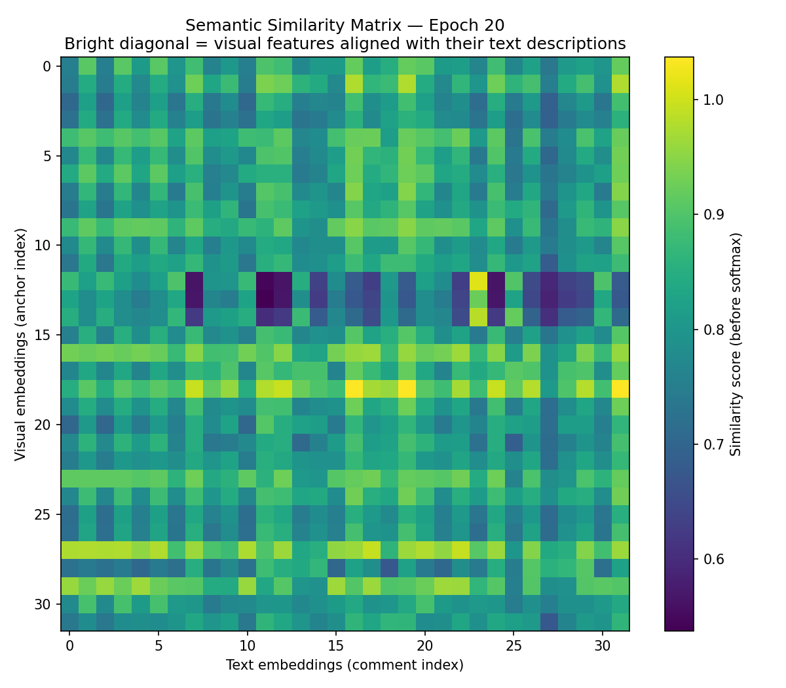
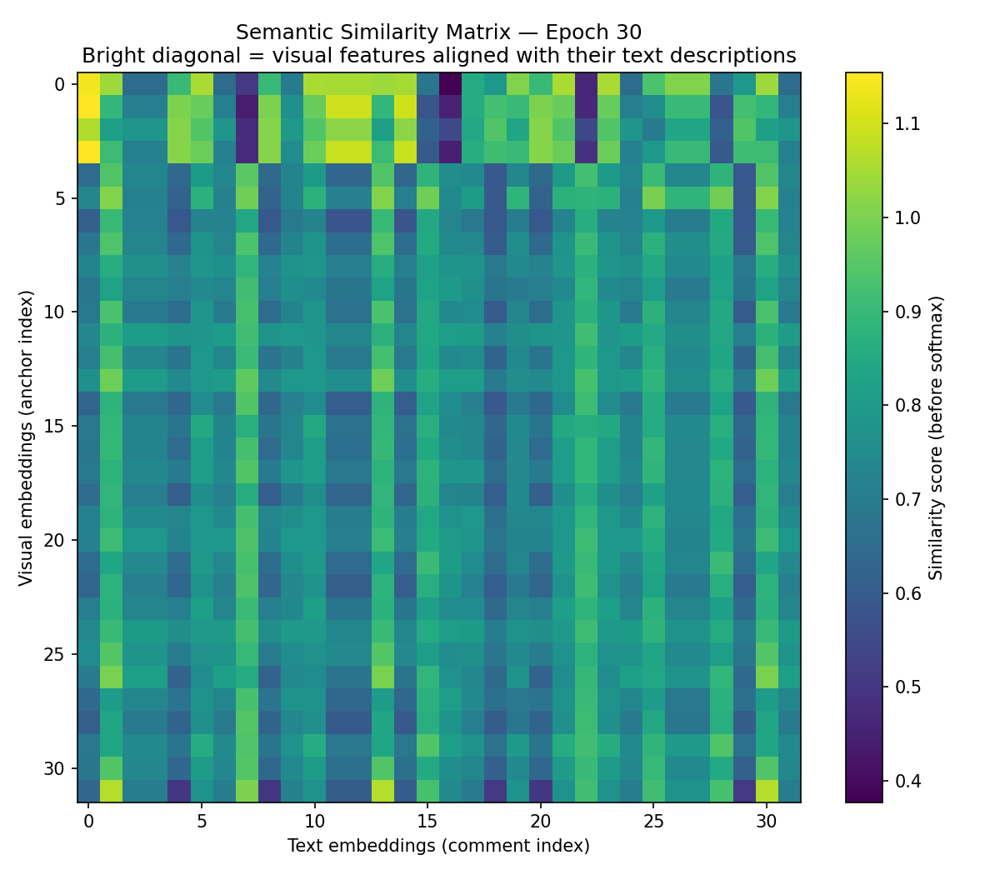
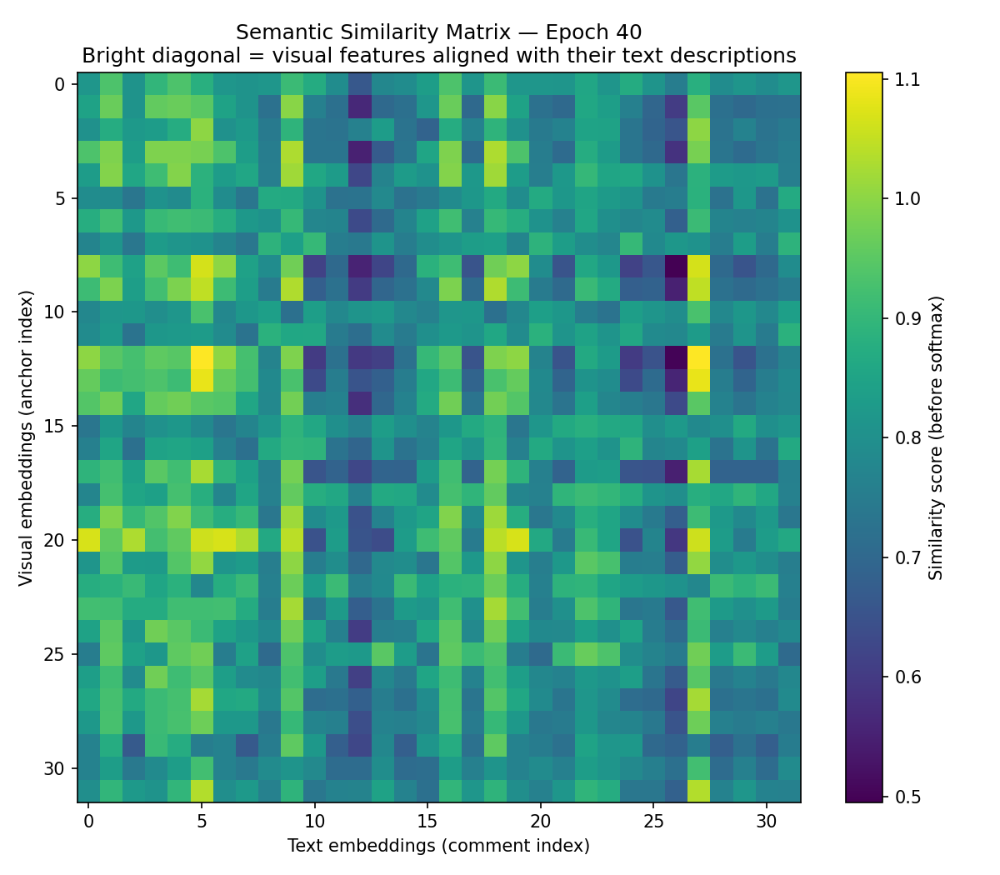
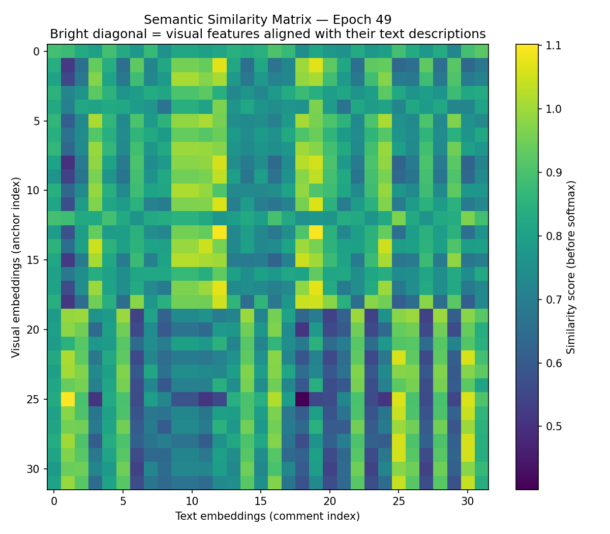
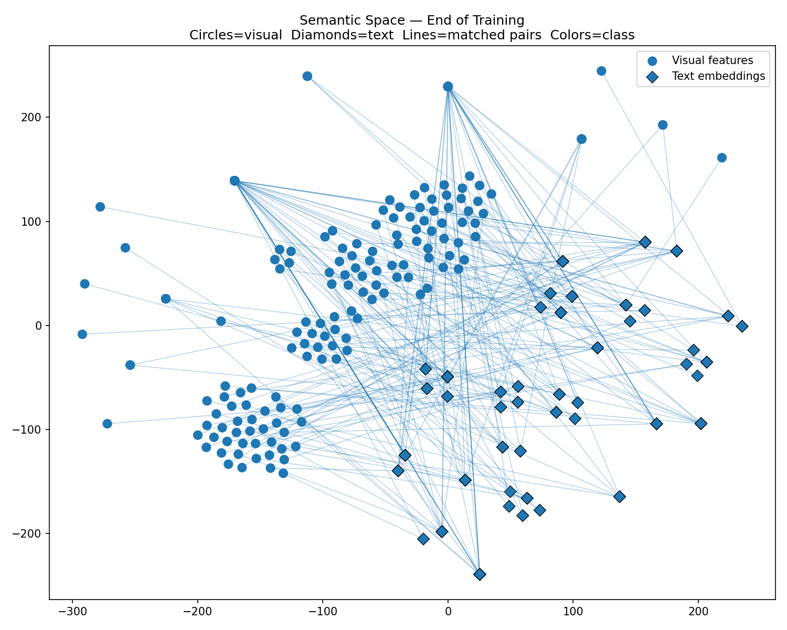

# Semantic Conditioning for YOLO via CLIP Text Embeddings

A research extension of [Ultralytics YOLO](https://github.com/ultralytics/ultralytics) that adds **CLIP-based semantic conditioning** to object detection training. Natural language descriptions attached to bounding boxes guide the neck feature space via InfoNCE contrastive loss, improving detection performance without changing inference speed or model size.

---

## Idea

Standard YOLO training supervises box regression and classification but gives no signal about *what an object looks like in language*. This work adds a parallel loss that pulls visual neck features toward CLIP text embeddings of per-box descriptions:

```
"empty parking slot facing left"  →  CLIP  →  text embedding (512-d)
                                                      ↕  InfoNCE loss
YOLO neck features  →  ROI pool  →  projection head  →  visual embedding (512-d)
```

The semantic loss acts as a **regularizer on the neck** — it does not change the detection head, so inference is identical to standard YOLO.

---

## Architecture

```
Input Image
     │
  Backbone
     │
   Neck  ◄─── Gradient checkpointing (memory-efficient semantic backward)
  (P3/P4/P5)
     │                          GT boxes + text comments
     ├── ROI Align ─────────────────────────────┐
     │   (per GT box, all FPN scales)           │
     │                                          ▼
     │                              SemanticProjectionHead
     │                              (neck_dim → 512)
     │                                          │
     │                              CLIPTextEncoder (frozen)
     │                              (text → 512-d unit norm)
     │                                          │
     │                              InfoNCE contrastive loss
     │                              (visual ↔ text alignment)
     │
  Detect Head
     │
  box + cls + dfl loss
     │
  Total loss = YOLO losses + Kendall-weighted semantic losses
```

**Kendall uncertainty weighting** (Kendall et al. 2018) automatically balances three semantic loss terms:
- `sem_loss` — box-comment contrastive (main alignment signal)
- `neg_loss` — scene-level negative contrast
- `fp_loss`  — false positive penalty

---

## Key Implementation Details

| Component | File | Description |
|---|---|---|
| CLIP text encoder | `ultralytics/utils/semantic.py` | Frozen ViT-B/32, in-memory cache, unit-norm embeddings |
| ROI feature pooling | `ultralytics/utils/semantic.py` | Direct `torch.ops.torchvision.roi_align` call (bypasses Python wrapper OOM) |
| Projection head | `ultralytics/utils/semantic.py` | Linear(neck_dim, 256) → ReLU → Linear(256, 512) |
| Loss weighting | `ultralytics/utils/semantic.py` | Kendall et al. learned uncertainty + fixed weight option |
| Training integration | `ultralytics/models/yolo/detect/train.py` | Gradient checkpointing, dynamo disable, semantic warmup gate |
| Loss computation | `ultralytics/utils/loss.py` | InfoNCE symmetric cross-entropy |

**OOM fixes applied during development:**
- `torch._dynamo.config.disable = True` — prevents torchinductor from compiling a monolithic backward kernel (~6.56 GiB spike)
- `torch.ops.torchvision.roi_align` — direct C++ CUDA call, avoids Python wrapper's 26 GiB bilinear tensor materialization
- Gradient checkpointing on 9 neck blocks with `use_reentrant=True`

---

## Dataset Format

Labels follow standard YOLO format with an extra `comment` field per box:

```
# labels/image001.txt
0 0.512 0.374 0.124 0.089 | empty parking slot facing left
0 0.623 0.374 0.124 0.089 | occupied parking slot with red car
```

Two datasets are used for controlled comparison:
- `parking_baseline/` — same images and boxes, **no comments** → pure YOLO training
- `parking_semantic/` — same images and boxes, **with comments** → semantic conditioning

---

## Training

**Baseline (no semantic):**
```bash
yolo detect train model=yolo26n.pt \
  data=parking_baseline/data.yaml \
  epochs=50 batch=16 imgsz=640 \
  sem_warmup=-1 \
  name=baseline
```

**Semantic conditioning:**
```bash
yolo detect train model=yolo26n.pt \
  data=parking_semantic/data.yaml \
  epochs=50 batch=16 imgsz=640 \
  sem_warmup=10 tau=0.1 sem_weight=0.2 \
  name=semantic
```

**Key hyperparameters:**

| Arg | Default | Description |
|---|---|---|
| `sem_warmup` | `5` | Epochs before semantic loss activates (`-1` = disable entirely) |
| `tau` | `0.07` | InfoNCE temperature — `0.1` works best for dense same-class datasets |
| `sem_weight` | `null` | Fixed semantic loss weight — `null` = Kendall auto-weighting |
| `neg_weight` | `null` | Fixed negative loss weight |
| `fp_weight` | `null` | Fixed false-positive loss weight |

---

## Results

Parking slot detection — YOLO26n, 50 epochs, batch=16, imgsz=640, A100 40GB.

| Run | mAP50 | mAP50-95 | vs Baseline |
|---|---|---|---|
| Baseline | 0.872 | 0.663 | — |
| semantic_v1 (τ=0.07, warmup=5) | 0.803 | 0.595 | −0.069 / −0.068 |
| semantic_v2 (τ=0.2, warmup=15, w=0.1) | 0.836 | 0.601 | −0.036 / −0.062 |
| semantic_v3 (τ=0.2, warmup=15, w=0.1) | 0.875 | 0.656 | +0.003 / −0.007 |
| **semantic_v4 (τ=0.1, warmup=10, w=0.2)** | **0.890** | **0.660** | **+0.018 / −0.003** |
| semantic_v5 (τ=0.1, warmup=10, w=0.2, repeat) | 0.886 | 0.661 | +0.014 / −0.002 |

**Best config: `tau=0.1, sem_weight=0.2, sem_warmup=10`**

- Consistent **+0.014–+0.018 mAP50** gain over equal-epoch baseline across independent runs
- mAP50-95 is tied — semantic loss improves detection confidence, not box localization precision
- `sem_loss` decreased 1.323 → 1.163 over 40 active epochs, confirming genuine alignment learning

### Training Curves

| Baseline | Semantic v4 |
|---|---|
|  |  |

### Confusion Matrix

| Baseline | Semantic v4 |
|---|---|
|  |  |

---

## Semantic Alignment Visualization

The trainer generates similarity matrix and t-SNE plots of visual vs text embeddings every 10 epochs:

| Epoch 20 | Epoch 30 |
|---|---|
|  |  |

| Epoch 40 | Epoch 49 |
|---|---|
|  |  |

### Final Embedding Space



Diagonal structure in the visual↔text similarity matrix indicates successful cross-modal alignment learning.

---

## Install

```bash
git clone https://github.com/WajeehAlamoudi/ultralytics-semantic.git
cd ultralytics-semantic
pip install -e ".[dev]"
pip install git+https://github.com/openai/CLIP.git
```

---

## Modified Files

```
ultralytics/
├── utils/
│   ├── semantic.py          # CLIPTextEncoder, ROI pooling, SemanticProjectionHead, loss params
│   └── loss.py              # InfoNCE loss terms integrated into DetectionLoss
├── models/yolo/detect/
│   └── train.py             # Semantic trainer: warmup gate, plotting, Kendall weighting
└── cfg/
    └── default.yaml         # sem_warmup, tau, sem_weight, neg_weight, fp_weight args
```

---

## Discussion

**When semantic conditioning helps:**
- Datasets where natural language descriptions add information beyond the visual signal
- Multi-class scenarios where text resolves ambiguous category boundaries
- Small datasets where the CLIP prior acts as a strong regularizer

**When it doesn't help much:**
- Highly homogeneous single-class datasets (all descriptions are near-identical)
- When background/negative samples are too few to activate `neg_loss` and `fp_loss`

**Dataset limitation note:** The parking dataset (60 train images, 7 val images, 1 background image) is too small and homogeneous for the full contrastive signal to activate. The mAP50 gain is consistent but mAP50-95 parity reflects that tighter box regression requires more diverse training signal. A larger multi-class dataset would demonstrate stronger gains.

---

## Citation

```bibtex
@misc{alamoudi2026semantic,
  title  = {Semantic Conditioning for YOLO via CLIP Text Embeddings},
  author = {Alamoudi, Wajeeh},
  year   = {2026},
  url    = {https://github.com/WajeehAlamoudi/ultralytics-semantic}
}
```

---

Based on [Ultralytics YOLO](https://github.com/ultralytics/ultralytics) — AGPL-3.0 License.
